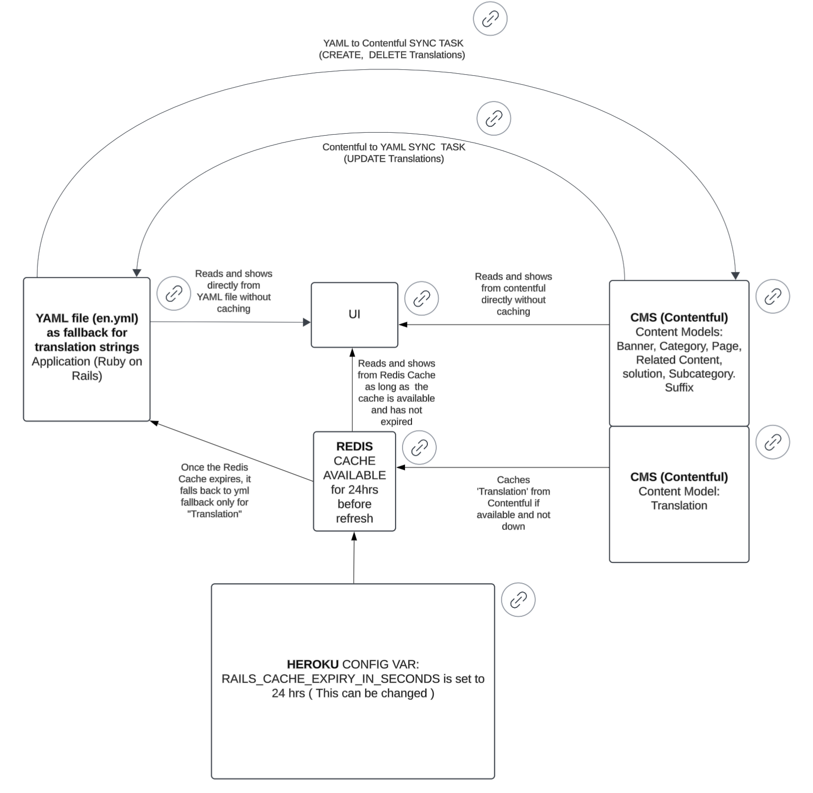

### **Rails, Redis and Contentful Caching**

## **Summary**
This application integrates with Contentful to fetch and cache translations dynamically. To ensure high availability and performance, we use **Redis** as the caching layer for storing Contentful Content Model - 'Translation' with well-managed YAML file fallback and expiration policies.

## **Caching Mechanism**
### 1. **Redis as the Cache Store**
FABS uses the caching mechanism for storing Contentful `translations`. 
It is configured in the Rails application with a specified expiration time.
Cached 'translations' help the application remain responsive and functional even if Contentful encounters any downtime.



**Cache Configuration in :`config/environments/production.rb`**
``` ruby
config.cache_store = :redis_cache_store,
                     {
                       url: ENV.fetch("REDIS_URL"),
                       ssl_params: { verify_mode: OpenSSL::SSL::VERIFY_NONE },
                       namespace: "myapp:cache",
                       expires_in: I18n::Backend::Contentful::CACHE_EXPIRY
                     }
```
In `config/environments/development.rb` however `config.cache_store` is set to `:memory_store`
- **Redis URL**: Provided via `ENV['REDIS_URL']`. Ensure this environment variable is set for the application through Heroku.
- **Namespace**: All cache keys are prefixed with `myapp:cache` to avoid collisions with other keys in Redis ( ex: Sidekiq which uses redis too.) 
- **Cache Expiry**: Provided via `ENV['RAILS_CACHE_EXPIRY_IN_SECONDS']`. Ensure this environment variable is set for the application through Heroku. This is typically set to `86400` (24 hours), depending on application requirements and can be altered (or for testing purposes).
`I18n::Backend::Contentful::CACHE_EXPIRY` is set to inherit from `ENV['RAILS_CACHE_EXPIRY_IN_SECONDS']` in the code.

### 2. **How Contentful translations are Cached**
Contentful translations are fetched and cached using the following mechanisms:

- **Primary Cache**: Content for the content-model 'Translation' from Contentful is stored in Redis under the key for a certain duration as mentioned in `ENV['RAILS_CACHE_EXPIRY_IN_SECONDS']`.
- **Cache Logic**:
    - If Redis contains valid cached data, it is directly served.
    - If Redis cache is empty or expired, the application attempts to fetch fresh data from Contentful, re-populate the cache, and serve the new content.
    - If fetching from Contentful fails (e.g., due to an API error or network issue) it falls back to getting the translations from the YAML file.
- **Key Methods in Use:**
    - Ensures the application always serves translations from Redis if available. If not, it fetches from Contentful and updates Redis -  `load_translations` in `lib/i18n/backend/contentful.rb`
    - Periodically refreshes cached data to ensure the freshest content without removing older data if fetching fails. -  `refresh_contentful_cache` in `config/initializers/contentful_initializer.rb`

### 3. **Contentful Integration with YAML Fallback in `production.rb`**
This application uses **Contentful** for translations with a **YAML fallback** to ensure reliability.

#### **1. Chained Backend Configuration**
- **Primary Backend**: fetches translations dynamically. `I18n::Backend::Contentful`
- **Fallback Backend**: (YAML) is used if Contentful fails to initialize. `I18n::Backend::Simple`
- **Chaning the two above**: Combining Contentful and YAML -  `I18n::Backend::Chain`

#### **2. Error Handling**
- Contentful initialization failure logs:
  _"Failed to initialize Contentful I18n backend: [error]. Falling back to YAML translations."_
- Ensures translations are still served from YAML.

#### **3. Redis Caching**
- Uses Redis as a cache for Contentful translations with expiration.
- If Redis is empty or expired, fetches fresh translations from Contentful.

#### **4. Localization Fallback**
- Default locale: . `:en`
- Missing translations fallback to English.

#### **5. Workflow**
1. Check Redis for cached translations.
2. If missing, fetch Contentful translations and cache them into Redis.
3. Fallback to YAML if Contentful and Redis are unavailable.

**Outcome**: Reliable, performant i18n with robust fallbacks.

### 4. **Fallback Logic**
To avoid disruptions in the user experience:
- When Contentful fails to provide the content in the translations, the cached translations already in Redis are used as a fallback.
- The application ensures that Redis cache isn't wiped on Contentful fetch failures, preventing stale content from being unavailable.

## **Refreshing Cache with Contentful**
The method is responsible for updating Redis with the latest data from Contentful -  `refresh_contentful_cache` in `config/initializers/contentful_initializer.rb`
1. Deletes the existing key in Redis only after successfully fetching the new translations - `contentful_translations`
2. If there’s an issue during this process, the application retains the old cache and logs the error for debugging and monitoring.

Example Code Snippet:
``` ruby
Rails.cache.write(
  I18n::Backend::Contentful::CACHE_KEY,
  cached_translations,
  expires_in: I18n::Backend::Contentful::CACHE_EXPIRY
)
```
## **Configuration Options**
To customize caching behavior, update the following environment variables:
- **`REDIS_URL`**: The Redis connection string.
- **`RAILS_CACHE_EXPIRY_IN_SECONDS`**: Defines how long the cached translations remain valid. Default is `86400` seconds (24 hours). Change this to suit the desired frequency of refresh.
- **`CONTENTFUL_xxxx`**: Ensure Contentful-related keys (`SPACE_ID`, `ACCESS_TOKEN`, `ENVIRONMENT`, `MANAGEMENT_TOKEN`   etc.) are correctly configured.

### **Useful Commands**
#### **Manually Refreshing Cache**
One can manually trigger a refresh of Contentful translations using a Rails console command:
``` ruby
Contentful.refresh_contentful_cache
```
#### **Clearing the Cache**
To clear all cached data in Redis (if needed), the following command can be run in the Rails console:
``` ruby
Rails.cache.clear
```

## List of Methods and Tasks Handling Contentful Refresh, Load Translations, and Related Functions
The following is a list of all methods and tasks affecting Contentful operations, including cache refresh, translations handling, and syncing.

### **Key Methods**
1. **(Cache Refresh)`refresh_contentful_cache`**
  - Deletes existing stale cache for Contentful translations.
  - Fetches fresh translations data and updates Redis cache.
  - File: . `config/initializers/contentful_initializer.rb`

2. **(YAML Loading)`load_flattened_translations`**
  - Loads and flattens translations from a given YAML file into a simplified format.
  - Raises errors if the file does not exist or contains invalid translations.
  - File: . `lib/contentful_helper.rb`

3. **`fetch_contentful_translations`**
  - Fetches translations data directly from Contentful (using the Contentful API).
  - Returns a list of fetched entries.
  - File: . `lib/contentful_helper.rb`

4. **`transform_contentful_translations`**
  - Normalizes and processes Contentful translation entries into a flattened hash.
  - Handles localization and missing key or value fields.
  - File: . `lib/contentful_helper.rb`

5. **`create_contentful_entry`**
  - Creates a new translation entry in Contentful for a given key-value pair.
  - Also publishes the new entry after creation.
  - File: . `lib/contentful_helper.rb`

6. **`unpublish_contentful_entry`**
  - Unpublishes a translation entry in Contentful by its entry ID.
  - File: . `lib/contentful_helper.rb`

7. **`delete_contentful_entry`**
  - Deletes a translation entry from Contentful by its entry ID.
  - File: . `lib/contentful_helper.rb`

8. **`validate_environment_variables`**
  - Ensures required environment variables (e.g., , ) are properly configured before any Contentful-related operations. `CONTENTFUL_SPACE_ID``CONTENTFUL_MANAGEMENT_TOKEN`
  - File: . `lib/contentful_helper.rb`

#### **YAML-Contentful Sync Rake Tasks**
   Refer to the file [yml-contentful-sync-tasks.md](yml-contentful-sync-tasks.md)


## **Troubleshooting**

The following commands can be used to interact with Redis directly from the Rails console:
1. **Check Connectivity**
   
Verify Redis is running and reachable from rails console :
``` ruby
   require "redis"
   redis = Redis.new(url: ENV["REDIS_URL"], ssl_params: { verify_mode: OpenSSL::SSL::VERIFY_NONE })
   redis.ping # Returns "PONG" if the connection is successful
```

2. **Basic Key-Value Operations**
   
This helps confirm Redis is operational before configuring Rails to use it.

``` ruby
   redis.set("foo", "bar") # Store a key-value pair
   redis.get("foo")        # Retrieve a value by key
```

3. **Using Rails Cache with Redis**

Use these commands from the rails console as the app is already configured to use the Redis.
- **Cache Write**
``` ruby
     Rails.cache.write("foo", "bar")
```
- **Cache Read**
``` ruby
     Rails.cache.read("foo") # Returns "bar"
```
- **Cache Delete**
``` ruby
     Rails.cache.delete("foo")
```
