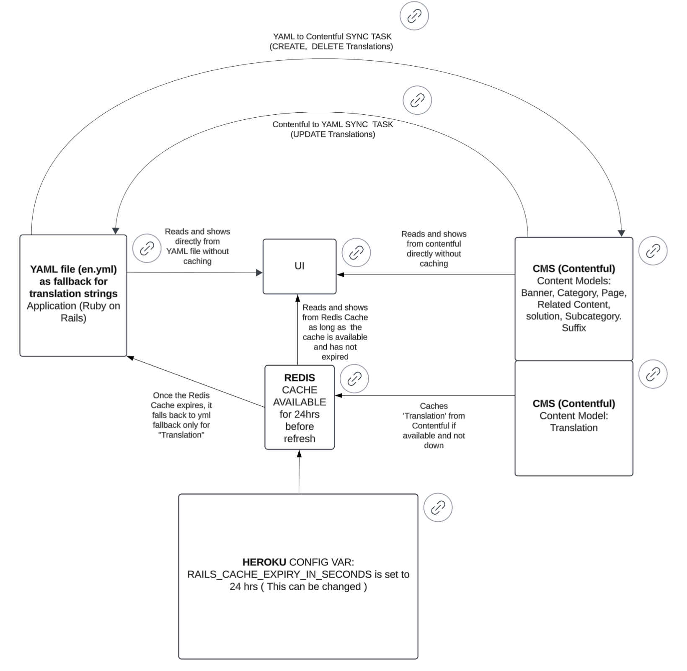

# Sync Tasks between YAML File and Contentful
This document provides an overview of the Rake tasks available to sync 'Translations' between the local YAML file (`en.yml`)  and Contentful (Content Model: Translation)

## Summary
The file(en.yml) is like a "dictionary" for the ruby application that stores all the English text shown to users, such as labels, buttons, and error messages. This file ensures the app's text is centralized and easy to update. These translations texts are those that remain constant for all buying solutions and categories defining the page header, button, footers, title, descriptions etc.
On the other hand, Contentful is an external platform where this same data can also be stored for collaboration and easy content management( from proc-ops). The synchronization process between the file(en.yml) and Contentful ensures they both stay aligned.
When a change is made to the translations, such as adding a new text, it first happens in the local file(en.yml).
Then, a script pushes these changes to Contentful, either adding new translations or updating existing ones if changed in en.yml.
Similarly, if there are changes in Contentful, they can be pulled and updated in the file(en.yml).

This two-way synchronization keeps the translations consistent between the local app and the external content management system (Contentful), ensuring users always see the correct and updated text, whether it's managed by developers or via Contentful by content managers.

The YAML-Contentful sync process involves three primary tasks, which form the complete sync process when executed together:
1. **Upload new translations from YAML (`en.yml`) to Contentful**. 
2. **Delete obsolete translations from Contentful (not found in `en.yml`)**.
3. **Update translations from Contentful back to `en.yml`**.

These tasks ensure that the translations stay consistent between the local YAML file and Contentful.



## List of Tasks
### 1. **Sync All Steps from above**
This task orchestrates the full sync process, combining all three steps into a single command.

**Task Name:**
``` bash
rake contentful:yml_contentful_sync
```
**Description:**
- Step 1: Uploads new translations from YAML (`en.yml`) to Contentful. (`en_to_contentful_translations_create.rake`)
- Step 2: Deletes obsolete translations from Contentful that are no longer in `en.yml`(`en_to_contentful_translations_delete.rake`)
- Step 3: Pulls updated translations from Contentful back to `en.yml` (`contentful_to_en_translations_update.rake`)

**Usage:**
``` bash
rake contentful:yml_contentful_sync
```
Logs and console output will indicate the progress 
and any errors encountered.

### 2. **Upload Translations**

**Task Name:**
``` bash
rake contentful:en_to_contentful_translations_create
```
**Description:**
- This task uploads new translations from the local YAML file (`en.yml`) into Contentful. 
- Any translations in the YAML that are new will be created and published in Contentful.

**Usage:**
``` bash
rake contentful:en_to_contentful_translations_create
```
**YAML File Path and Environment Variables:**
- YAML file path: `config/locales/en.yml`
- Requires the following environment variables to be set:
    - : The ID of the Contentful space. `CONTENTFUL_SPACE_ID`
    - : The management token to authenticate API access. `CONTENTFUL_MANAGEMENT_TOKEN`

### 3. **Delete Obsolete Translations**

**Task Name:**
``` bash
rake contentful:en_to_contentful_translations_delete
```
**Description:**
- Compares the keys in the YAML file (`en.yml`) with the keys stored in Contentful.
- Any translations in Contentful that **don’t exist** in the YAML file will be deleted.
- The entries will first be unpublished and then deleted from Contentful.

`en.yml`

**Usage:**
``` bash
rake contentful:en_to_contentful_translations_delete
```
**YAML File Path and Environment Variables:**
- YAML file path: `config/locales/en.yml`
- Requires the following environment variables to be set:
    - : The ID of the Contentful space. `CONTENTFUL_SPACE_ID`
    - : The management token to authenticate API access. `CONTENTFUL_MANAGEMENT_TOKEN`

### 4. **Sync Contentful to `en.yml`**
**Task Name:**
``` bash
rake contentful:contentful_to_en_translations_update
```
**Description:**
- Pulls updated translations from Contentful and updates the local YAML file (`en.yml`).
- Ensures any changes in Contentful overwrite the corresponding entries in the YAML file translations.

**Usage:**
``` bash
rake contentful:contentful_to_en_translations_update
```
**YAML File Path and Environment Variables:**
- YAML file path: `config/locales/en.yml`
- Requires the following environment variables to be set:
    - : The ID of the Contentful space. `CONTENTFUL_SPACE_ID`
    - : The management token to authenticate API access. `CONTENTFUL_MANAGEMENT_TOKEN`

The following shows how to set these:
``` bash
export CONTENTFUL_SPACE_ID="contentful_space_id"
export CONTENTFUL_MANAGEMENT_TOKEN="contentful_management_token"
```

## Example Workflow
Here is an example of a full sync workflow using the tasks:
1. Upload new translations: **Step 1:**
``` bash
rake contentful:en_to_contentful_translations_create
```
2. Delete obsolete translations: **Step 2:**
``` bash
rake contentful:en_to_contentful_translations_delete
```
3. Sync updates from Contentful back to the local file: **Step 3:**`en.yml`
``` bash
rake contentful:contentful_to_en_translations_update
```
**Or, run the complete sync using:**
``` bash
rake contentful:yml_contentful_sync
```
## Debugging
Logs and console output are printed during task execution to help identify issues.

## Conclusion
By using these tasks, one can easily manage the translations between the local YAML file and 'translations' in Contentful, keeping them in sync and ensuring no translations are lost or left obsolete.
